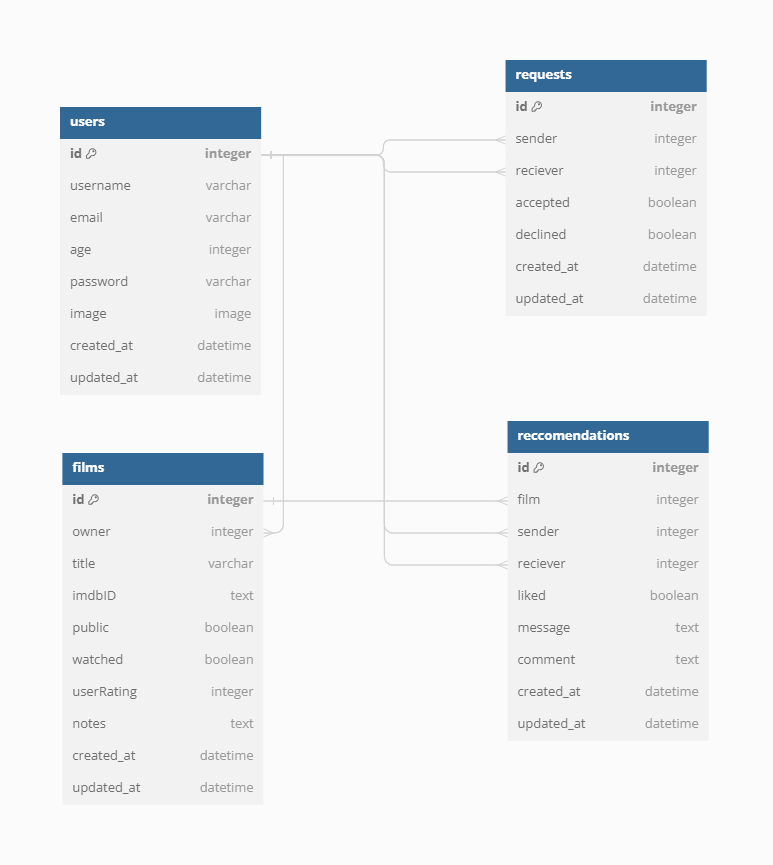

# Film Friends
Introduction
Picture (use amiresponsive.org)
## Live Site
[https://film-friends.onrender.com/](https://film-friends.onrender.com/)
## Repository
[https://github.com/AlexSmall96/Film-Friends](https://github.com/AlexSmall96/Film-Friends)
## Author
Alex Small | [GitHub](https://github.com/AlexSmall96) | [LinkedIn](https://www.linkedin.com/in/alex-small-a8977116b/)
## Table of Contents

## Project Goals and Planning

### Database Schema
The below diagram was used to model the database schema. An interactive version can be found [here](https://dbdocs.io/alex.small739/Film-Friends-Db-Schema?view=relationships).
Descriptions of the database tables and fields are as follows:
- **Users**
Contains Users login and profile data.
- **Films**
Films that the user has saved. The public field determines wether or not others can see the film on the users list. The watched field is true or false depending on if the user has watched the film or not. 
- **Requests**
Friend requests between users. Sender_id is the user id of the requester, reciver_id is the user id of the user recieving the friend request. Accepted is true or false depending if the user has accepted the friend request.
- **Reccomendations**
Film reccomendations between users. Request_id is the id of the request that must be made and accepted prior to sending a reccomendation. The reciever can set liked to true and add a comment on the reccomendation.

 
### Methodology
 
### User Stories
#### Allow me to sign up to Film Friends
- Users can sign up using a chosen email, username, and password.
#### Allow me to login to Film Friends with my account
- After a user has signed up, they can log in to access the full functionality of the site.
#### Allow me to delete my account
- Users can choose to delete the account.
#### Allow me to save films, rate them, mark them as watched and remove them from my list
- User can save a film to their watchlist, rate it, add notes, and mark it as watched.
- User can view all their films in a list.
- User can decide which of their films in the list can be viewed by others.
#### Allow me to add friends and view their film lists
- Users can find each other on the app by username.
- Users can add and accept friend requests.
- Users can view friends' film lists, only seeing films the user has allowed others to see.
- Users are unable to see other users lists who have not accepted their friend requests.
#### Allow me to make recommendations to my friends
- Users can send a film recommendation to friends.
- Users are unable to send recommendations to other users who have not accepted their friend requests.
- Receiver of recommendation can like and comment.
#### Allow me to view and customize my profile
- Users can edit their name and profile image.
- Users can change their email or password.
## UX

### Target Audience

### Wireframes
The below wireframes were created to plan the front end layout of the app. For each page, a large view and mobile view have been created.

**Home Page**

**Profile Page**

**Friends Page**

**Reccomendations Page**

 

**Sign up/Login Page**

 
### Colours

### Fonts

### Images

## Programming Languages, Frameworks, and Libraries used

## Testing

## Deployment

## Credits
Reference udemy course when code is used:
 - [https://www.udemy.com/course/the-complete-nodejs-developer-course-2](https://www.udemy.com/course/the-complete-nodejs-developer-course-2)
## Code
### Deployment
The below dev.to article was used to deploy the project to [Render](https://dashboard.render.com/) :

- [https://dev.to/pixelrena/deploying-your-reactjs-expressjs-server-to-rendercom-4jbo](https://dev.to/pixelrena/deploying-your-reactjs-expressjs-server-to-rendercom-4jbo)