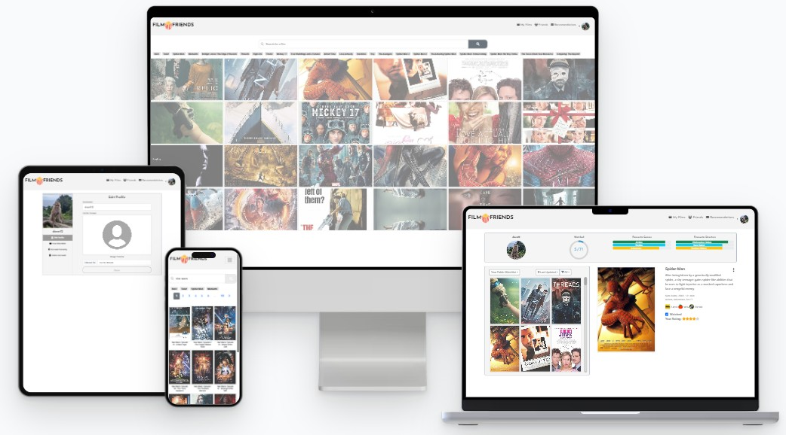
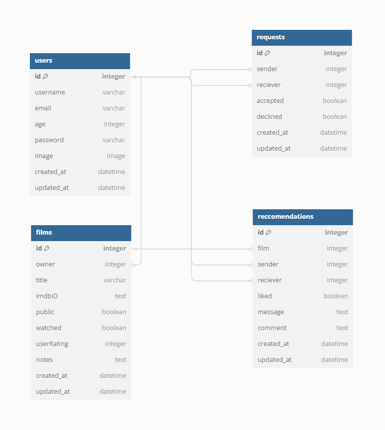

# Film Friends
Film Friends is a film sharing and reviewing app, where users can save and rate films, add each other as friends, and share recommendations. The back end is built using node.js and the Express framework, while the front end is built in React. The film data is taken from the [Open Movie Database (OMDB) API](https://www.omdbapi.com/).

### [🌐 Live Site](https://film-friends.onrender.com)

### [📖 Repository](https://github.com/AlexSmall96/Film-Friends)

Users can search and view film details while not logged in. To access the full functionality of the site, an account must be created. Alternatively, clicking 'Continue as Guest' will log the user in to a shared guest account. Guests can save and rate films, add friends, and send recommendations. In order to preserve data, destructive actions like profile updates, film removal, and account deletion are disabled for guests. 

The site is currently deployed to Render, defaulting to its free tier. During application periods, the paid starter tier is used to eliminate loading times.

## 💻 Tech Stack
| Backend | Frontend | Database | Testing (Vitest) | Other Tools |
| :------:|:------: | :------: | :------: | :------: |
| Node.js   |   React      | MongodDB       | Supertest         |  GitHub       |  
| Express  |    Bootstrap  | Mongoose       | React Testing Library   | Postman        |  

## 🧪 Testing 
See [Testing](https://github.com/AlexSmall96/Film-Friends/blob/main/TESTING.MD)

### 🗃️ Database Schema
The below diagram was used to model the database schema. An interactive version can be found [here](https://dbdocs.io/alex.small739/Film-Friends-Db-Schema?view=relationships).
Descriptions of the database tables and fields are as follows:
- **Users**
Contains User's login and profile data.
- **Films**
Films that the user has saved. The public field determines whether or not others can see the film on the user's list. The watched field is true or false depending on whether the user has watched the film or not.
- **Requests**
Friend requests between users. Sender is the user ID of the requester, and receiver is the user ID of the user receiving the friend request. Accepted is true or false depending if the user has accepted the friend request.
- **Recommendations**
Film recommendations between users. Sender is the id of the user that sends the recommendation and receiver is the id of the user that receives the recommendation. A request must be made and accepted prior to sending a recommendation. 

## 👤Author
Alex Small | [GitHub](https://github.com/AlexSmall96) | [LinkedIn](https://www.linkedin.com/in/alex-small-a8977116b/)

## 🤝 Credits
### Courses
 - [https://www.udemy.com/course/the-complete-nodejs-developer-course-2](https://www.udemy.com/course/the-complete-nodejs-developer-course-2)
 - [https://www.udemy.com/course/react-testing-library](https://www.udemy.com/course/react-testing-library)
### APIs
The film data is taken from the [Open Movie Database (OMDB) API](https://www.omdbapi.com/).
### Code
Code was taken from/inspired by the below articles. Whenever the code is used, it is referenced as a comment.

- Deploying to Render:
[https://dev.to/pixelrena/deploying-your-reactjs-expressjs-server-to-rendercom-4jbo](https://dev.to/pixelrena/deploying-your-reactjs-expressjs-server-to-rendercom-4jbo)

- Uploading images to cloudinary: https://dev.to/njong_emy/how-to-store-images-in-mongodb-using-cloudinary-mern-stack-imos

- Removing match media errors from certain tests: https://stackoverflow.com/questions/39830580/jest-test-fails-typeerror-window-matchmedia-is-not-a-function

- To track screen width: https://stackoverflow.com/questions/36862334/get-viewport-window-height-in-reactjs 

- To send OTP: https://www.makeuseof.com/password-reset-forgot-react-node-how-handle/

- To automatically change home page carousel: https://upmostly.com/tutorials/settimeout-in-react-components-using-hooks 

- To show search suggestion on home page: https://www.dhiwise.com/post/how-to-build-react-search-bar-with-suggestions#customizing-the-autocomplete-behavior 

- To convert an image to base 64 was taken from https://dev.to/njong_emy/how-to-store-images-in-mongodb-using-cloudinary-mern-stack-im

- To set the preview file was taken from: https://www.geeksforgeeks.org/how-to-upload-image-and-preview-it-using-reactjs/

- The plotPreview class was inspired by https://stackoverflow.com/questions/7993067/text-overflow-ellipsis-not-working

- The filmRow:hover class was taken from Taken from https://stackoverflow.com/questions/33203148/how-to-make-a-div-box-look-3d 

- The code used in renderWithProviders.jsx to render the component with memory router was taken from: https://medium.com/@bobjunior542/using-useparams-in-react-router-6-with-jest-testing-a29c53811b9e

- Scrollbar styling: https://css-tricks.com/classy-and-cool-custom-css-scrollbars-a-showcase/
