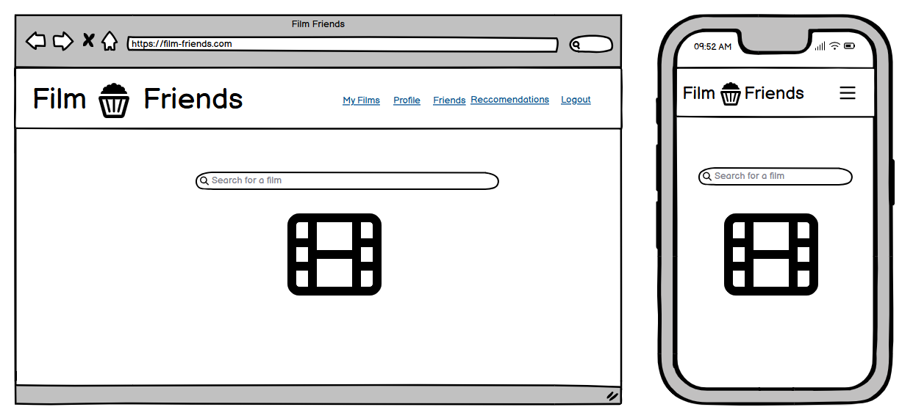
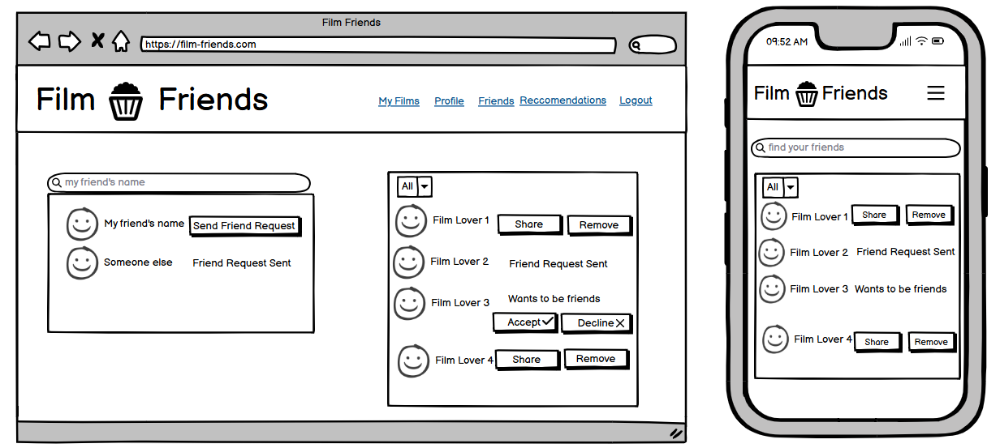
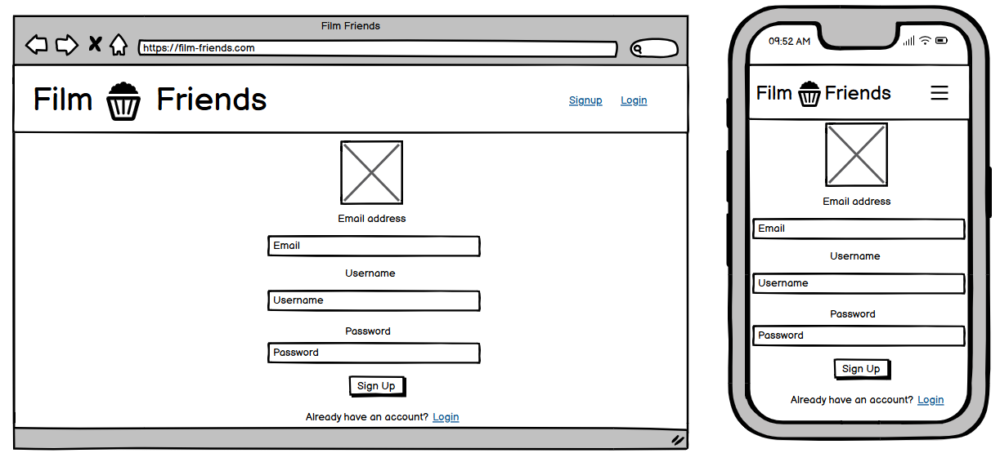

# Film Friends
Introduction
Picture (use amiresponsive.org)
## Live Site
[https://film-friends.onrender.com/](https://film-friends.onrender.com/)
## Repository
[https://github.com/AlexSmall96/Film-Friends](https://github.com/AlexSmall96/Film-Friends)
## Author
Alex Small | [GitHub](https://github.com/AlexSmall96) | [LinkedIn](https://www.linkedin.com/in/alex-small-a8977116b/)
## Table of Contents

## Project Goals and Planning
### Process Flow Diagrams
#### Login and Sign Up

#### Save a new Film

#### Search for Users and Send Friend Requests

#### Send a Reccomendation

### Database Schema
The below diagram was used to model the database schema. An interactive version can be found [here](https://dbdocs.io/alex.small739/Film-Friends-Db-Schema?view=relationships).
Descriptions of the database tables and fields are as follows:
- **Users**
Contains User's login and profile data.
- **Films**
Films that the user has saved. The public field determines whether or not others can see the film on the user's list. The watched field is true or false depending on whether the user has watched the film or not.
- **Requests**
Friend requests between users. Sender is the user ID of the requester, and reciever is the user ID of the user receiving the friend request. Accepted is true or false depending if the user has accepted the friend request.
- **Reccomendations**
Film recommendations between users. Sender is the id of the user that sends the reccomendation and reciever is the id of the user that recieves the reccomendation. A request must be made and accepted prior to sending a recommendation. The receiver can set liked to true and add a comment on the recommendation.

### Methodology
The project used an agile methodology and was divided into 5 sprints. Throughout, a kanban board was used to plan and track progress.

- Include a picture of a finished kanban board
#### Sprint 1: Planning and Documentation
This phase involved the brainstorming of the initial idea as well as designing the theme and layout of the user interface. The process flow diagram was created to plan a high-level overview of the functionality of the site. The process flow diagram was then used as a guide in deciding the database schema, creating the wireframes, and the backend site logic.

#### Sprint 2: Backend Functionality
The backend logic for the project was written in [Node.js](https://nodejs.org/en). The [Express](https://expressjs.com/) framework was used to create all the HTTP endpoints required based on the process flow diagram and the database schema. [MongoDB](https://www.mongodb.com/) was used for both the development and production database. A local database was used for both development and automated testing, with [Postman](https://www.postman.com/) being used to test the Express code and simulate HTTP requests before the front-end section of the site was built. [Studio 3T](https://studio3t.com/) was used to validate requests made through postman, and monitor changes in the local database during development. 

Postman HTTP Requests               |           Studio 3T Database Analysis
:-------------------------:| :-------------------------: 
              | | 

Collections in Studio 3T:

Automated testing using [jest](https://jestjs.io/) and the [supertest package](https://www.npmjs.com/package/supertest) was implemented for all HTTP requests in parallel to development, and an associated test file can be found alongside each of the router files in [this folder](https://github.com/AlexSmall96/Film-Friends/tree/main/routers). See [Testing](#testing) for details.

The methodology in this section was inspired by the below Udemy course.
 - [https://www.udemy.com/course/the-complete-nodejs-developer-course-2](https://www.udemy.com/course/the-complete-nodejs-developer-course-2)

#### Sprint 3: Frontend Functionality

#### Sprint 4: Frontend Styling

#### Sprint 5: Remaining Documentation and Manual Testing
### User Stories
#### Allow me to sign up for Film Friends
- Users can sign up using a chosen email, username, and password.
#### Allow me to log in to Film Friends with my account
- After a user has signed up, they can log in to access the full functionality of the site.
#### Allow me to delete my account
- Users can choose to delete the account.
#### Allow me to save films, rate them, mark them as watched and remove them from my list
- User can save a film to their watchlist, rate it, add notes, and mark it as watched.
- User can view all their films in a list.
- User can decide which of their films in the list can be viewed by others.
#### Allow me to add friends and view their film lists
- Users can find each other on the app by username.
- Users can add and accept friend requests.
- Users can view friends' film lists, only seeing films the user has allowed others to see.
- Users are unable to see other users lists who have not accepted their friend requests.
#### Allow me to make recommendations to my friends
- Users can send a film recommendation to friends.
- Users are unable to send recommendations to other users who have not accepted their friend requests.
- Receiver of recommendation can like and comment.
#### Allow me to view and customize my profile
- Users can edit their name and profile image.
- Users can change their email or password.
## UX

### Target Audience

### Wireframes
The wireframes below were created to plan the app's front-end layout. A large view and a mobile view have been made for each page.

**Home Page**

**Profile Page**

**Friends Page**

**Recommendations Page**

**Sign up**

**Login Page**

**Films Page**

### Colours

### Fonts

### Images

## Programming Languages, Frameworks, and Libraries used

## Testing

## Deployment

## Credits
Reference Udemy course when code is used:
 - [https://www.udemy.com/course/the-complete-nodejs-developer-course-2](https://www.udemy.com/course/the-complete-nodejs-developer-course-2)
## Code
### Deployment
The below dev.to article was used to deploy the project to [Render](https://dashboard.render.com/) :

- [https://dev.to/pixelrena/deploying-your-reactjs-expressjs-server-to-rendercom-4jbo](https://dev.to/pixelrena/deploying-your-reactjs-expressjs-server-to-rendercom-4jbo)

Uploading images to cloudinary
- https://dev.to/njong_emy/how-to-store-images-in-mongodb-using-cloudinary-mern-stack-imo