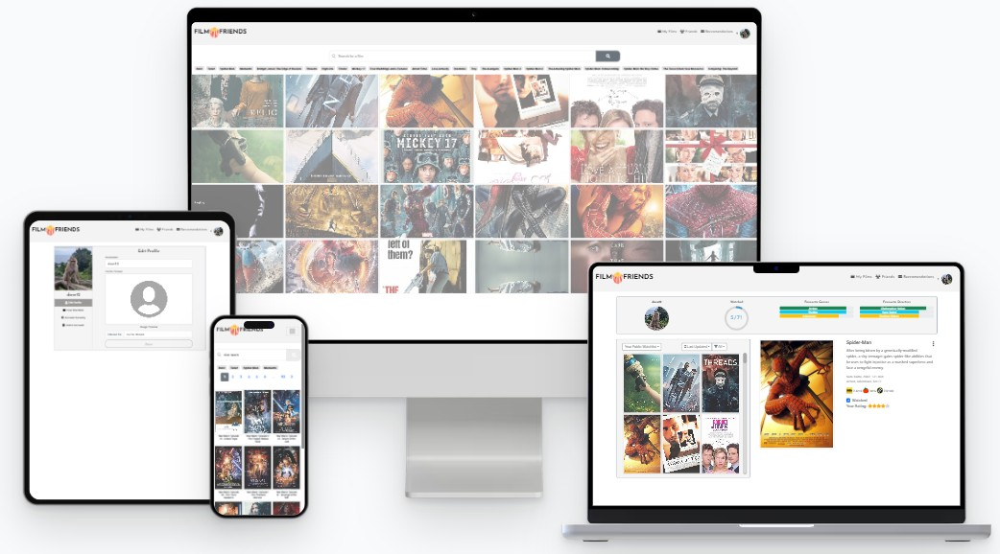
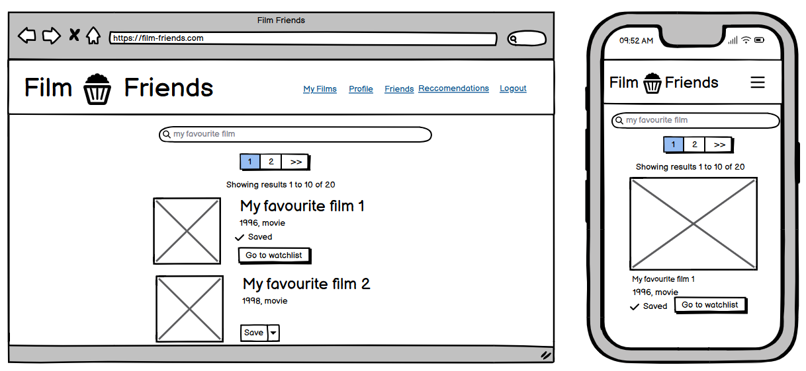

# Film Friends
Film Friends is a film sharing and reviewing app, where users can save and rate films, add each other as friends, and share recommendations. The back end is built using node.js and the Express framework, while the front end is built in React. The film data is taken from the [Open Movie Database (OMDB) API](https://www.omdbapi.com/).

Further previews of the site can be found in [Testing](https://github.com/AlexSmall96/Film-Friends/blob/main/TESTING.MD).
## Live Site
[https://film-friends.onrender.com/](https://film-friends.onrender.com/)

Users can search and view film details while not logged in. To access the full functionality of the site, an account must be created. Alternatively, clicking 'Continue as Guest' will log the user in to a shared guest account. Guests can save and rate films, add friends, and send recommendations. In order to preserve data, destructive actions like profile updates, film removal, and account deletion are disabled for guests. 

The site is currently deployed to Render, defaulting to its free tier. During application periods, the paid starter tier is used to eliminate loading times.

## Repository
[https://github.com/AlexSmall96/Film-Friends](https://github.com/AlexSmall96/Film-Friends)
## Author
Alex Small | [GitHub](https://github.com/AlexSmall96) | [LinkedIn](https://www.linkedin.com/in/alex-small-a8977116b/)
## Table of Contents
- [Film Friends](#film-friends)
  * [Live Site](#live-site)
  * [Repository](#repository)
  * [Author](#author)
  * [Table of Contents](#table-of-contents)
  * [Testing](#testing)
  * [Project Goals and Planning](#project-goals-and-planning)
    + [Process Flow Diagrams](#process-flow-diagrams)
      - [Login and Sign Up](#login-and-sign-up)
      - [Save a new Film](#save-a-new-film)
      - [Search for Users and Send Friend Requests](#search-for-users-and-send-friend-requests)
      - [Send a Recommendation](#send-a-recommendation)
    + [Database Schema](#database-schema)
    + [Methodology](#methodology)
      - [Sprint 1: Planning and Documentation](#sprint-1--planning-and-documentation)
      - [Sprint 2: Backend Functionality](#sprint-2--backend-functionality)
      - [Sprint 3: Frontend Functionality](#sprint-3--frontend-functionality)
      - [Sprint 4: Frontend Styling](#sprint-4--frontend-styling)
      - [Sprint 5: Remaining Documentation and Testing](#sprint-5--remaining-documentation-and-testing)
    + [User Stories](#user-stories)
      - [Allow me to sign up for Film Friends](#allow-me-to-sign-up-for-film-friends)
      - [Allow me to log in to Film Friends with my account](#allow-me-to-log-in-to-film-friends-with-my-account)
      - [Allow me to delete my account](#allow-me-to-delete-my-account)
      - [Allow me to save films, rate them, mark them as watched and remove them from my list](#allow-me-to-save-films--rate-them--mark-them-as-watched-and-remove-them-from-my-list)
      - [Allow me to add friends and view their film lists](#allow-me-to-add-friends-and-view-their-film-lists)
      - [Allow me to make recommendations to my friends](#allow-me-to-make-recommendations-to-my-friends)
      - [Allow me to view and customize my profile](#allow-me-to-view-and-customize-my-profile)
  * [UX](#ux)
    + [Target Audience](#target-audience)
    + [Wireframes](#wireframes)
    + [Fonts](#fonts)
    + [Images](#images)
  * [Programming Languages, Frameworks, and Libraries used](#programming-languages--frameworks--and-libraries-used)
  * [Other technologies used](#other-technologies-used)
  * [Credits](#credits)
    + [Courses](#courses)
    + [APIs](#apis)
    + [Code](#code)
    + 
## Testing 
See [Testing](https://github.com/AlexSmall96/Film-Friends/blob/main/TESTING.MD)

## Project Goals and Planning
The goal of this project was to develop my skills in React, Node.js and automated testing, while creating a website that real film lovers would use to organise their films and connect with others.

### Process Flow Diagrams
To plan the end to end processes involved in the site, the following diagrams were created.
#### Login and Sign Up

#### Save a new Film

#### Search for Users and Send Friend Requests

#### Send a Recommendation

### Database Schema
The below diagram was used to model the database schema. An interactive version can be found [here](https://dbdocs.io/alex.small739/Film-Friends-Db-Schema?view=relationships).
Descriptions of the database tables and fields are as follows:
- **Users**
Contains User's login and profile data.
- **Films**
Films that the user has saved. The public field determines whether or not others can see the film on the user's list. The watched field is true or false depending on whether the user has watched the film or not.
- **Requests**
Friend requests between users. Sender is the user ID of the requester, and receiver is the user ID of the user receiving the friend request. Accepted is true or false depending if the user has accepted the friend request.
- **Recommendations**
Film recommendations between users. Sender is the id of the user that sends the recommendation and receiver is the id of the user that receives the recommendation. A request must be made and accepted prior to sending a recommendation. 

### Methodology
The project used an agile methodology and was divided into 5 sprints. Throughout, a kanban board was used to plan and track progress.

#### Sprint 1: Planning and Documentation
This phase involved the brainstorming of the initial idea as well as designing the theme and layout of the user interface. The process flow diagram was created to plan a high-level overview of the functionality of the site. The process flow diagram was then used as a guide in deciding the database schema, creating the wireframes, and the backend site logic.

#### Sprint 2: Backend Functionality
The backend logic for the project was written in [Node.js](https://nodejs.org/en). The [Express](https://expressjs.com/) framework was used to create all the HTTP endpoints required based on the process flow diagram and the database schema. [MongoDB](https://www.mongodb.com/) was used for both the development and production database. A local database was used for development, with [Postman](https://www.postman.com/) being used to test the Express code and simulate HTTP requests before the front-end section of the site was built. [Studio 3T](https://studio3t.com/) was used to validate requests made through postman, and monitor changes in the local database during development. 

Postman HTTP Requests               |           Studio 3T Database Analysis
:-------------------------:| :-------------------------: 
              | | 

Collections in Studio 3T:

Automated testing using [vitest](https://vitest.dev/) and the [supertest package](https://www.npmjs.com/package/supertest) was implemented for all HTTP requests (with the exception of those requiring external APIs or emails) in parallel to development, and an associated test file can be found alongside each of the router files in [this folder](https://github.com/AlexSmall96/Film-Friends/tree/main/routers). See [Testing](https://github.com/AlexSmall96/Film-Friends/blob/main/TESTING.MD) for details.

The methodology in this section was inspired by the Udemy course: [https://www.udemy.com/course/the-complete-nodejs-developer-course-2](https://www.udemy.com/course/the-complete-nodejs-developer-course-2)

#### Sprint 3: Frontend Functionality
This phase began by creating the basic page layout used to implement the processes required. As the project grew in complexity, sub components were added to pages and the react architecture was refined. With many layers of subcomponents, contexts became useful to better manage state. Throughout this phase some of the backend routers were updated to accommodate new functionality. A diagram detailing the final structure of the react architecture is given below. Components are coloured according to their level in the hierarchy. Grey components have no subcomponents, and arrows travel in the direction of parent -> child.

#### Sprint 4: Frontend Styling
Once the layout had been finalised and the functionality was working as expected, the visual appearance of the site was refined. This included font choice, colours, margins, images and responsiveness.
#### Sprint 5: Remaining Documentation and Testing
This phase involved updating some backend router tests before creating unit tests and integration tests for the front end using [vitest](https://vitest.dev/) and [react testing library](https://testing-library.com/). After this, manual tests were carried out to test features not covered in automated testing. End to end testing was then implemented to verify that the models in the database had full CRUD functionality and the user was given visual feedback to represent these changes.

## UX

### User Stories

#### Allow me to sign up for Film Friends
- Users can sign up using a chosen email, username, and password.
#### Allow me to log in to Film Friends with my account
- After a user has signed up, they can log in to access the full functionality of the site.
#### Allow me to delete my account
- Users can choose to delete the account.
#### Allow me to save films, rate them, mark them as watched and remove them from my list
- User can save a film to their watchlist, rate it, and mark it as watched.
- User can view all their films in a list.
- User can decide which of their films in the list can be viewed by others.
#### Allow me to add friends and view their film lists
- Users can find each other on the app by username.
- Users can add and accept friend requests.
- Users can view friends' public film lists.
#### Allow me to make recommendations to my friends
- Users can send a film recommendation to friends.
- Users are unable to send recommendations to other users who have not accepted their friend requests.
#### Allow me to view and customize my profile
- Users can edit their name and profile image.
- Users can change their email or password.
- 
### Target Audience
The target audience of this site is anyone who is passionate about films, and enjoys organising and planning their film viewing, as well as connecting with others over common film interests.
### Wireframes
The wireframes below were created to plan the app's front-end layout. A large view and a mobile view have been made for each page.

**Home Page**

**Film Search**

**Profile Page**

**Friends Page**

**Recommendations Page**

**Sign up**

**Login Page**

**Films Page**

### Fonts
The fonts used in this site are; Josefin Sans for the heading, Gudea for the film plots and Roboto Flex for everything else.

### Images
The film images used in this site come from the [Open Movie Database (OMDB) API](https://www.omdbapi.com/), while the placeholder images were created on [https://pixelied.com](https://pixelied.com/).

## Programming Languages, Frameworks, and Libraries used
- Backend
    - Node.js
    - Express
- Frontend
    - React
    - React Bootstrap
Testing
    - Vitest
    - Supertest
    - React Testing Library
    - Mock Service Worker

## Other technologies used
- Deployment
    - Render
- Database
    - MongoDB
    - MongoDB Compass
    - Studio 3T
- Images
    - Cloudinary
- Development
    - VS code
    - GitHub
- Documentation
    - dbdocs
    - Balsamiq
    - lucidchart
    - screentogif

## Credits
### Courses
 - [https://www.udemy.com/course/the-complete-nodejs-developer-course-2](https://www.udemy.com/course/the-complete-nodejs-developer-course-2)
 - [https://www.udemy.com/course/react-testing-library](https://www.udemy.com/course/react-testing-library)
### APIs
The film data is taken from the [Open Movie Database (OMDB) API](https://www.omdbapi.com/).
### Code
Code was taken from/inspired by the below articles. Whenever the code is used, it is referenced as a comment.

- Deploying to Render:
[https://dev.to/pixelrena/deploying-your-reactjs-expressjs-server-to-rendercom-4jbo](https://dev.to/pixelrena/deploying-your-reactjs-expressjs-server-to-rendercom-4jbo)

- Uploading images to cloudinary: https://dev.to/njong_emy/how-to-store-images-in-mongodb-using-cloudinary-mern-stack-imos

- Removing match media errors from certain tests: https://stackoverflow.com/questions/39830580/jest-test-fails-typeerror-window-matchmedia-is-not-a-function

- To track screen width: https://stackoverflow.com/questions/36862334/get-viewport-window-height-in-reactjs 

- To send OTP: https://www.makeuseof.com/password-reset-forgot-react-node-how-handle/

- To automatically change home page carousel: https://upmostly.com/tutorials/settimeout-in-react-components-using-hooks 

- To show search suggestion on home page: https://www.dhiwise.com/post/how-to-build-react-search-bar-with-suggestions#customizing-the-autocomplete-behavior 

- To convert an image to base 64 was taken from https://dev.to/njong_emy/how-to-store-images-in-mongodb-using-cloudinary-mern-stack-im

- To set the preview file was taken from: https://www.geeksforgeeks.org/how-to-upload-image-and-preview-it-using-reactjs/

- The plotPreview class was inspired by https://stackoverflow.com/questions/7993067/text-overflow-ellipsis-not-working

- The filmRow:hover class was taken from Taken from https://stackoverflow.com/questions/33203148/how-to-make-a-div-box-look-3d 

- The code used in renderWithProviders.jsx to render the component with memory router was taken from: https://medium.com/@bobjunior542/using-useparams-in-react-router-6-with-jest-testing-a29c53811b9e

- Scrollbar styling: https://css-tricks.com/classy-and-cool-custom-css-scrollbars-a-showcase/
