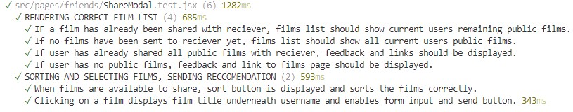
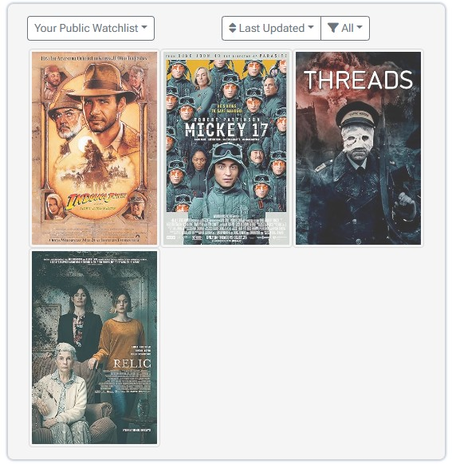
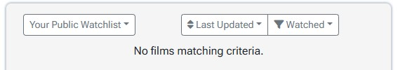
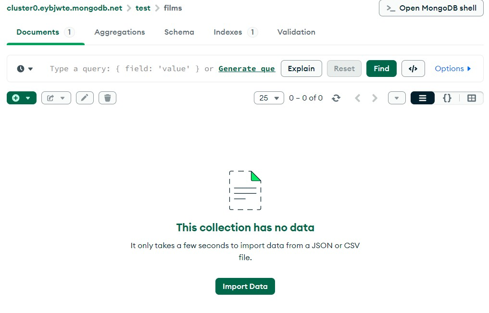

# Testing
Several methodologies were used to test the site. The backend HTTP requests were tested in parralel to development, and all HTTP requests were covered by automated tests, with the exception of those that rely on the [OMDB API](https://www.omdbapi.com/) and those that involve sending emails. The front end section of the site was tested using automated tests and manual tests. The automated tests being divded into unit tests and integration tests. A finally category of tests was defined; End to End testing. This was included to ensure all 4 models (users, films, requests and reccomendations) had full CRUD functionality, and the user interface gave feedback on these operations where appropriate.
## Automated Testing
### Backend
The HTTP request were tested using [vitest](https://vitest.dev/) and the [supertest package](https://www.npmjs.com/package/supertest). Automated tests cover all HTTP requests with the exception of the following:

Method              |           URL | Reasoning for ommiting
:-------------------------:| :-------------------------: | :-------------------------:|
|GET | /data/filmSearch | Reliance on external API|
|GET | /data/filmData | Reliance on external API|
|POST |/data/users/sendEmail | Reliance on nodemailer |
|PATCH | /data/users/me | Image upload could not be tested

Features not covered by automated tests will be tested manually.

The 4 router files each have an associated test file. Screenshots of the test results are given below.

[user.test.js](https://github.com/AlexSmall96/Film-Friends/tree/main/routers/user.test.js)

[film.test.js](https://github.com/AlexSmall96/Film-Friends/tree/main/routers/film.test.js)

[request.test.js](https://github.com/AlexSmall96/Film-Friends/tree/main/routers/request.test.js)

[reccomendation.test.js](https://github.com/AlexSmall96/Film-Friends/tree/main/routers/reccomendation.test.js)

Note: When ran together, several tests sometimes fail. Since the database is wiped before each test, and all tests pass when ran individually, I chose to take the individual results as passing. 
### Frontend
The front end section of the site was tested with automated and manual tests, using Vitest and React Testing Library. Where appropriate, a test file for each React component was created. Mock data was used in the tests, these were passed into the components either diectly through props or contexts, or using  [Mock Service Worker (MSW)](https://mswjs.io/) to intercept and mock request handlers. The methodology for the following automated tests was based on the Udemy course:
[https://www.udemy.com/course/react-testing-library](https://www.udemy.com/course/react-testing-library)

#### Unit Tests
For relevant subcomponents, a test file was created. Screenshots of the results for each test file are given below.

[Avatar.test.jsx](https://github.com/AlexSmall96/Film-Friends/tree/main/src/components/Avatar.test.jsx)

[DeleteModal.test.jsx](https://github.com/AlexSmall96/Film-Friends/tree/main/src/components/DeleteModal.test.jsx)

[FilmPreview.test.jsx](https://github.com/AlexSmall96/Film-Friends/tree/main/src/components/FilmPreview.test.jsx)

[NavBar.test.jsx](https://github.com/AlexSmall96/Film-Friends/tree/main/src/components/NavBar.test.jsx)

[ResultsPagination.test.jsx](https://github.com/AlexSmall96/Film-Friends/tree/main/src/components/ResultsPagination.test.jsx)

[SaveDropdown.test.jsx](https://github.com/AlexSmall96/Film-Friends/tree/main/src/components/SaveDropdown.test.jsx)

[EllipsisMenu.test.jsx](https://github.com/AlexSmall96/Film-Friends/tree/main/src/pages/films/EllipsisMenu.test.jsx)

[Film.test.jsx](https://github.com/AlexSmall96/Film-Friends/tree/main/src/pages/films/Film.test.jsx)

[Filters.test.jsx](https://github.com/AlexSmall96/Film-Friends/tree/main/src/pages/films/Filters.test.jsx)

[IconRating.test.jsx](https://github.com/AlexSmall96/Film-Friends/tree/main/src/pages/films/IconRating.test.jsx)

[PublicProfile.test.jsx](https://github.com/AlexSmall96/Film-Friends/tree/main/src/pages/films/PublicProfile.test.jsx)

[FriendRequestButtons.test.jsx](https://github.com/AlexSmall96/Film-Friends/tree/main/src/pages/friends/FriendRequestButtons.test.jsx)

[ShareModal.test.jsx](https://github.com/AlexSmall96/Film-Friends/tree/main/src/pages/friends/ShareModal.test.jsx)

[FilmBadges.test.jsx](https://github.com/AlexSmall96/Film-Friends/tree/main/src/pages/home/FilmBadges.jsx)

[FilmPosterCarousel.test.jsx](https://github.com/AlexSmall96/Film-Friends/tree/main/src/pages/home/FilmPosterCarousel.jsx)

#### Integration Tests
A selection of features were tested using integration tests, where multiple components were rendered on the same page, or a process relied on code from different components. Each integration test file with results is given below.

[FilmSearch.test.jsx](https://github.com/AlexSmall96/Film-Friends/tree/main/src/integration-tests/FilmSearch.test.jsx)

[Friends.test.jsx](https://github.com/AlexSmall96/Film-Friends/tree/main/src/integration-tests/Friends.test.jsx)

[LoginLogout.test.jsx](https://github.com/AlexSmall96/Film-Friends/tree/main/src/integration-tests/LoginLogout.test.jsx)

[Signup.test.jsx](https://github.com/AlexSmall96/Film-Friends/tree/main/src/integration-tests/Signup.test.jsx)

## Manual Testing
Manual testing was carried out on the remaining pages not covered by automated tests: Films Page, Reccomendations and Profile. The following tests cover front end user interaction and client side validation, any features that require HTTP requests are covered in End to End testing.

### Films Page

Test No.             |           Pass Criteria  | Screenshot
:-------------------------:| :-------------------------: |  :-------:|
1.1 | Correct films load in films list  | 
1.2 | Default Main Film is first in list  |  
1.3 | Clicking a film in film list changes main film  | 
1.4 | Filtering public/private changes which films are shown | 
1.5 | Filtering all/watched/still to watch changes which films are shown | 
1.6 | Sorting alphabetically/last updated changes order of films | 
1.7 | Message appears when no films match current filters  | 
1.8 | Viewing another users watchlist only shows public films | 
1.9 | When screen width is less than 768px, full view is only shown for one film at at time| 
1.10 | If a film in search results has go to watchlist link, clicking link goes to the current users watchlist, and clicked film is in main view| 

### Reccomendations
Test No.             |           Pass Criteria  | Screenshot
:-------------------------:| :-------------------------: |  :-------:|
2.1 | Correct films load in reccomendations list with messages | 
2.2 | Hovering over a film shows plot |  
2.3 | Filtering by sender changes which films are shown | 
2.4 | Sorting alphabetically or last sent changes order of films| 
2.5 | When screen width is less than 768px, only film images are shown, and the full view is only shown for one film at a time | 
2.6 | When user has recieved more than 10 reccomendations, pagination is displayed and changing page number chagnes which films are displayed | 
2.7 | If a film has go to watchlist link, clicking link goes to the current users watchlist, and clicked film is in main view| 

### Profile
Test No.             |           Pass Criteria  | Screenshot
:-------------------------:| :-------------------------: |  :-------:|
3.1 | Correct username and profile image load|  
3.2 | Clicking tabs changes what is displayed | 
3.3 | Clicking your watchlist takes the user to thier own watchlist |  
3.4 | Save button is disabled and becomes enabled if username or profile image is changed |  
3.5 | If too large an image is uploaded, error message appears| 

## End to End Testing
The purpose of this section is to ensure that all 4 models (users, films, requests and reccomendations) can be created, updated, read and deleted, and that these operations are visible in the database UI [Mongo DB Compass](https://www.mongodb.com/products/tools/compass) as well as the client. Read is not included as an operation in this section as this was coverd by manual and automated tests. 

### Users
Operation             | Functional Meaning           | Front end change | Database UI Change|
:-------------------------:| :-------------------------: |  :-------:|:-------:|
CREATE | Signing up | N/A | |
UPDATE | Updating Profile Data |  | |
UPDATE | Updating email address |   |  |
UPDATE | Updating password | | 
UPDATE | Resetting forgotten password |  | 
DELETE | Deleting account | |

### Films
Operation             | Functional Meaning           | Front end change | Database UI Change|
:-------------------------:| :-------------------------: |  :-------:|:-------:|
CREATE | Saving a film via search results | ||
UPDATE | Rating a film, marking as watched, making public/private| ||
DELETE | Removing a film from watchlist | |

### Requests
Operation             | Functional Meaning           | Front end change | Database UI Change|
:-------------------------:| :-------------------------: |  :-------:|:-------:|
CREATE | Send a friend request |  ||
UPDATE |Accept a friend request |  | 
DELETE | Decline or remove a friend request |  | 

### Reccomendations 
Operation             | Functional Meaning           | Front end change | Database UI Change|
:-------------------------:| :-------------------------: |  :-------:|:-------:|
CREATE | Send a reccomendation |  |  
DELETE | Remove a reccomendation | | 
## Responsiveness

