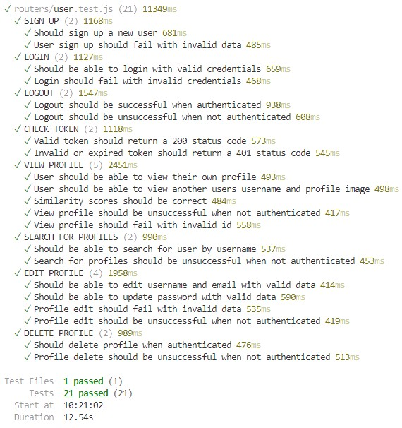

# Testing
Several methodologies were used to test the site. The backend HTTP requests were tested in parralel to development, and all HTTP requests were covered by automated tests, with the exception of those that rely on the [OMDB API](https://www.omdbapi.com/) and those that involve sending emails. The front end section of the site was tested using automated tests and manual tests. The automated tests being divded into unit tests and integration tests. A finally category of tests was defined; End to End testing. This was included to ensure all 4 models (users, films, requests and reccomendations) had full CRUD functionality, and the user interface gave feedback on these operations where appropriate.
## Automated Testing
### Backend
The HTTP request were tested using [vitest](https://vitest.dev/) and the [supertest package](https://www.npmjs.com/package/supertest). Automated tests cover all HTTP requests with the exception of the following:

Method              |           URL | Reasoning for ommiting
:-------------------------:| :-------------------------: | :-------------------------:|
|GET | /data/filmSearch | Reliance on external API|
|GET | /data/filmData | Reliance on external API|
|POST |/data/users/sendEmail | Reliance on nodemailer |
|PATCH | /data/users/me | Image upload could not be tested

Features not covered by automated tests will be tested manually.

The 4 router files each have an associated test file. Screenshots of the test results are given below.

[user.test.js](https://github.com/AlexSmall96/Film-Friends/tree/main/routers/user.test.js)

[film.test.js](https://github.com/AlexSmall96/Film-Friends/tree/main/routers/film.test.js)

[request.test.js](https://github.com/AlexSmall96/Film-Friends/tree/main/routers/request.test.js)

[reccomendation.test.js](https://github.com/AlexSmall96/Film-Friends/tree/main/routers/reccomendation.test.js)

Note: When ran together, several tests sometimes fail. Since the database is wiped before each test, and all tests pass when ran individually, I chose to take the individual results as passing. 
### Frontend
The front end section of the site was tested with automated and manual tests, using Vitest and React Testing Library. Where appropriate, a test file for each React component was created. Mock data was used in the tests, these were passed into the components either diectly through props or contexts, or using  [Mock Service Worker (MSW)](https://mswjs.io/) to intercept and mock request handlers. The methodology for the following automated tests was based on the Udemy course:
[https://www.udemy.com/course/react-testing-library](https://www.udemy.com/course/react-testing-library)

#### Unit Tests
For relevant subcomponents, a test file was created. Screenshots of the results for each test file are given below.

[Avatar.test.jsx](https://github.com/AlexSmall96/Film-Friends/tree/main/src/components/Avatar.test.jsx)

[DeleteModal.test.jsx](https://github.com/AlexSmall96/Film-Friends/tree/main/src/components/DeleteModal.test.jsx)

[FilmPreview.test.jsx](https://github.com/AlexSmall96/Film-Friends/tree/main/src/components/FilmPreview.test.jsx)

[NavBar.test.jsx](https://github.com/AlexSmall96/Film-Friends/tree/main/src/components/NavBar.test.jsx)

[ResultsPagination.test.jsx](https://github.com/AlexSmall96/Film-Friends/tree/main/src/components/ResultsPagination.test.jsx)

[SaveDropdown.test.jsx](https://github.com/AlexSmall96/Film-Friends/tree/main/src/components/SaveDropdown.test.jsx)

[EllipsisMenu.test.jsx](https://github.com/AlexSmall96/Film-Friends/tree/main/src/pages/films/EllipsisMenu.test.jsx)

[Film.test.jsx](https://github.com/AlexSmall96/Film-Friends/tree/main/src/pages/films/Film.test.jsx)

[Filters.test.jsx](https://github.com/AlexSmall96/Film-Friends/tree/main/src/pages/films/Filters.test.jsx)

[IconRating.test.jsx](https://github.com/AlexSmall96/Film-Friends/tree/main/src/pages/films/IconRating.test.jsx)

[PublicProfile.test.jsx](https://github.com/AlexSmall96/Film-Friends/tree/main/src/pages/films/PublicProfile.test.jsx)

[FriendRequestButtons.test.jsx](https://github.com/AlexSmall96/Film-Friends/tree/main/src/pages/friends/FriendRequestButtons.test.jsx)

[ShareModal.test.jsx](https://github.com/AlexSmall96/Film-Friends/tree/main/src/pages/friends/ShareModal.test.jsx)

[FilmBadges.test.jsx](https://github.com/AlexSmall96/Film-Friends/tree/main/src/pages/home/FilmBadges.jsx)

[FilmPosterCarousel.test.jsx](https://github.com/AlexSmall96/Film-Friends/tree/main/src/pages/home/FilmPosterCarousel.jsx)

#### Integration Tests
A selection of features were tested using integration tests, where multiple components were rendered on the same page, or a process relied on code from different components. Each integration test file with results is given below.

[FilmSearch.test.jsx](https://github.com/AlexSmall96/Film-Friends/tree/main/src/integration-tests/FilmSearch.test.jsx)

[Friends.test.jsx](https://github.com/AlexSmall96/Film-Friends/tree/main/src/integration-tests/Friends.test.jsx)

[LoginLogout.test.jsx](https://github.com/AlexSmall96/Film-Friends/tree/main/src/integration-tests/LoginLogout.test.jsx)

[Signup.test.jsx](https://github.com/AlexSmall96/Film-Friends/tree/main/src/integration-tests/Signup.test.jsx)

## Manual Testing

## End to end Testing

